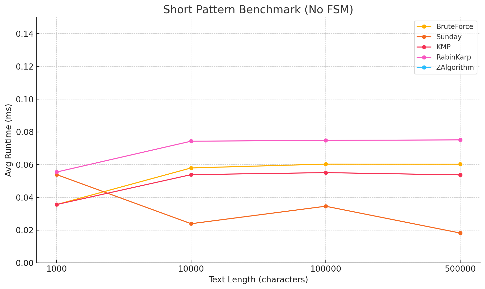

# Algorithms II — Pattern Matching Benchmark
### By Artem Lisenkov
[GitHub Project](https://github.com/artemlisenkov/algorithms2_assignment?tab=readme-ov-file)

---

## Algo Overview

This project compares six pattern matching algorithms:

- Brute-force
- Sunday
- KMP (Knuth-Morris-Pratt)
- FSM (Finite State Machine)
- Rabin-Karp
- Gusfield Z (Z Algorithm)

### Tested With:

- Short patterns
- Long patterns

---

## Pattern Matching Algorithm Comparison

In this project, I compare the runtime performance of six algorithms using real book text from *The Martian* by Andy Weir. All algorithms are implemented in **Java**.

---

## Algorithms Description

**Brute-force**  
Checks each line shift one character at a time, comparing character-by-character. Very slow, especially on large strings.

**Sunday**  
Improved brute-force: if there is a mismatch, shifts based on the character immediately after the first-appeared window. Works faster, especially for large alphabets.

**KMP**  
Uses a prefix table to avoid starting the comparison over after a mismatch. Effective for repetitive patterns.

**FSM**  
Creates an automaton (states and transitions) for searching. A table of states is built once, then searched in one pass. Good for frequent searches of a single pattern.

**Rabin-Karp**  
Hashes the pattern and each window of text. Compares hashes, and only if there is a match — the strings themselves. Works fast for multiple searches, but can give collisions.

**Z Algorithm**  
Constructs a Z-array showing the lengths of matches to the beginning of the string. Very fast and clean, especially if you need to search many times.

---

## Prerequisites

Tested each algorithm with:

- **Short pattern:** `"I don’t even know who’ll read this"`
- **Long pattern:** a full paragraph from the same book
- **Text sizes:** 1,000; 10,000; 100,000; 500,000 characters
- Each test repeated 3–5 times, average runtime recorded

---

## Results & Analysis

To improve readability, FSM was plotted separately due to its significantly higher runtime caused by preprocessing.

### Visual Benchmark Results

#### Short Pattern

#### Long Pattern

#### FSM Only — Short Pattern

#### FSM Only — Long Pattern

---

### 🔍 Observations

#### Short Pattern (excluding FSM)
- Brute-force was fastest on small texts but quickly plateaued.
- Sunday improved significantly at first but stabilized.
- KMP and Rabin-Karp remained consistent and competitive.

#### Long Pattern (excluding FSM)
- Brute-force scaled poorly beyond 10k.
- Sunday and Rabin-Karp were similar, though RK had some inconsistency.
- KMP had the best overall consistency.

#### FSM (separate)
- High preprocessing time (200ms+ on even 1k).
- Runtime slightly improved with larger text sizes.
- Only worth using when pattern is reused frequently.

---

## Algorithm Use Cases

**Brute-force**
- best for: very small texts, temporary searches
- worst for: anything over a few KB

**Sunday**
- best for: short patterns, large alphabets
- worst for: long patterns or very repetitive data

**KMP**
- best for: long texts, repeated patterns
- worst for: short patterns with low redundancy

**FSM**
- best for: repeated searches of same pattern
- worst for: one-off search (high setup time)

**Rabin-Karp**
- best for: searching multiple patterns
- worst for: single-pattern with high collision risk

**Z Algorithm**
- best for: fast one-pattern matching
- worst for: multiple patterns — not built for it

---

## Conclusion

Not all algorithms are created equal.  
Brute-force is easy but doesn’t scale. KMP and Z Algorithm are reliable and scalable. FSM is only worth it when the pattern is reused many times. Rabin-Karp and Sunday have niche uses, especially when fast skipping or hashing helps.

Choosing the right algorithm depends on the text, the pattern, and your constraints.

---

## Important Notice

The text samples used in this project are taken from *The Martian* by Andy Weir. This book is protected under copyright law. These excerpts have been used solely for educational and non-commercial purposes — specifically, to benchmark and compare the runtime performance of string matching algorithms as part of a university assignment.

No redistribution or reuse of the book’s content is intended or permitted beyond this project.  
**All rights remain with the original copyright holder(s).**

You can obtain the book legally here:
- [www.penguinrandomhouse.com](https://www.penguinrandomhouse.com/books/319998/the-martian-by-andy-weir/)
- [www.amazon.com](https://www.amazon.com/Martian-Andy-Weir/dp/0553418025/)

---

## Files Included

- `src/` – all Java source code (algorithms, runner, parser)
- `benchmark_short.csv` – benchmark results for short pattern
- `benchmark_long.csv` – benchmark results for long pattern
- `assets/` – images of graphs used in this README
- `LICENSE` – project license and fair use statement
