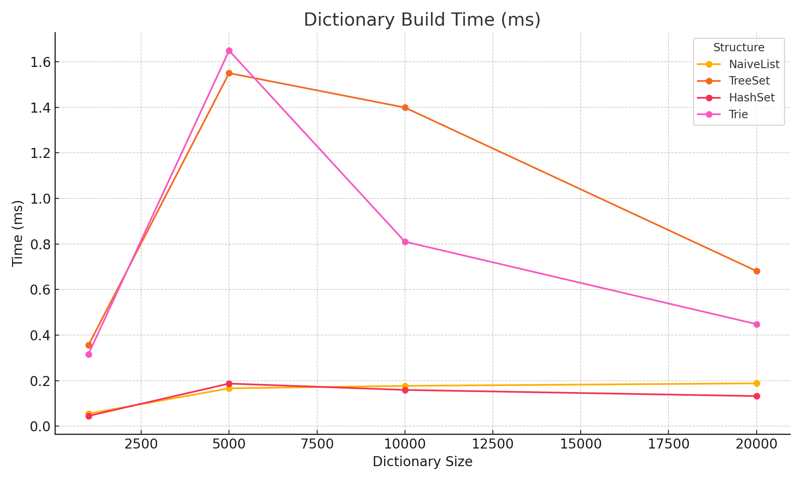
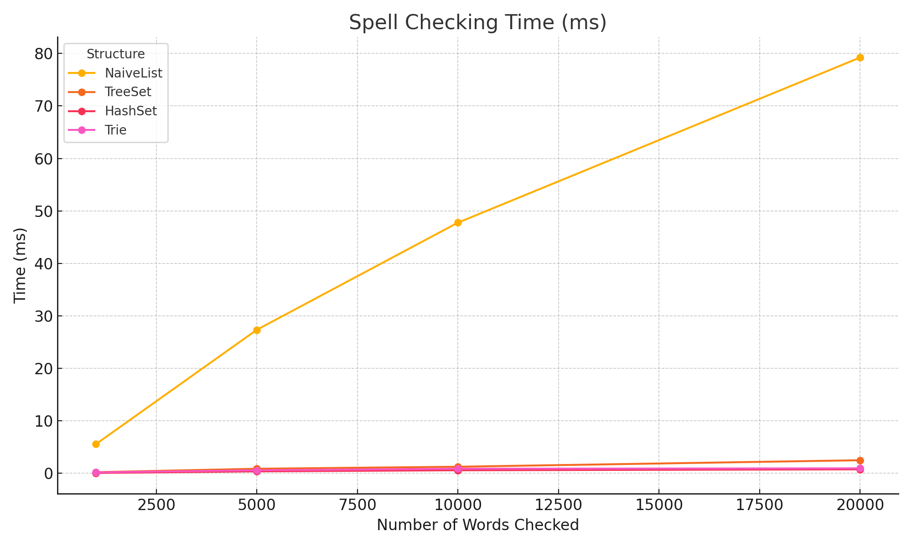

# Algorithms II
### By Artem Lisenkov
[GitHub Project](https://github.com/artemlisenkov/algorithms2_assignment?tab=readme-ov-file)

---

# ASSIGNMENT I : PART ONE

## Algo Overview

This project compares six pattern matching patternmatch:

- Brute-force
- Sunday
- KMP (Knuth-Morris-Pratt)
- FSM (Finite State Machine)
- Rabin-Karp
- Gusfield Z

---

## Part A — "Mom bought me a new computer"

### Pattern Matching Algorithm Comparison on Different Size Texts

In this project, I compare six pattern matching patternmatch using chapters from a book [[1](#1-important-notice)]. My goal is to evaluate their performance on various text lengths with short and long patterns. I implemented each algorithm in **Java** and measured their runtime.

---

### Algorithms Description

**Brute-force**  
Compares every possible shift character-by-character. Very slow on large texts.

**Sunday**  
Improves Brute-force by skipping based on the next character after the current window. Efficient on large alphabets.

**KMP**  
Uses a prefix table to avoid rechecking matched characters. Works well for repeated patterns.

**FSM**  
Builds an automaton for the pattern. Great for repeated searches, expensive for one-offs.

**Rabin-Karp**  
Hashes the pattern and window. Fast on multiple searches, but suffers from hash collisions.

**Z Algorithm**  
Builds a Z-array for prefix matching. Extremely fast, especially for repeated exact patterns.

---

### Prerequisites

Tested on:

- Short pattern: `"I don’t even know who’ll read this"`
- Long pattern: a full paragraph from the same book
- Text lengths: 1,000; 10,000; 100,000; 500,000 characters
- Each test repeated 3–5 times; average runtime recorded

---

### Results & Analysis

To improve readability, FSM is plotted separately due to its high preprocessing cost.

#### Short Pattern


#### Short Pattern (excluding FSM)

- Brute-force was fastest on tiny texts, but inefficient at scale
- Sunday improved early and stabilized
- KMP and Rabin-Karp showed consistent performance

---

#### Long Pattern


#### Long Pattern (excluding FSM)

- Brute-force performed poorly by 10k+
- Sunday and Rabin-Karp were similar
- KMP showed best overall consistency

---

#### FSM (Short Pattern)


#### FSM (Long Pattern)


#### FSM Performance

- Very high setup time (~200ms on 1k text)
- Matching becomes efficient post-setup
- Suitable only for repeated use cases

---

### Algorithm Use Cases

**Brute-force**
- best for: very small texts, simple searches
- worst for: anything large

**Sunday**
- best for: short patterns, large alphabets
- worst for: long patterns or repetitive text

**KMP**
- best for: repeated, long patterns
- worst for: short patterns with low redundancy

**FSM**
- best for: repeated use of the same pattern
- worst for: one-off searches due to setup cost

**Rabin-Karp**
- best for: many patterns at once
- worst for: one pattern with hash collisions

**Z Algorithm**
- best for: fast exact matching
- worst for: multi-pattern scenarios

---

### Part A Conclusion

Not all patternmatch are created equal. Brute-force is simple but slow. KMP and Z Algorithm provide the best scaling behavior. FSM is powerful but impractical for one-time use.

Algorithm choice depends on context: text size, pattern nature, and expected reuse.

---

## Part B — "Wacky Races"

This section explores specific cases where one algorithm significantly outperforms another. Each test uses:

- T (text) ≥ 100kB
- P (pattern) targeting algorithm-specific behavior
- Measured 5× and averaged

---

### Output Screenshot


---

### Case 1: Gusfield Z vs Binary Sunday

- **T:** `"aaaaaaabaaa..."` (repeating)
- **P:** `"bbbbaaa"`
- **Result:**
    - Sunday: 2.820 ms
    - ZAlgorithm: 0.533 ms
    - ⟶ **Z is 5.3× faster**

**Why:**  
Z skips over repetition efficiently. Sunday couldn't leverage its jump logic on uniform input.

---

### Case 2: KMP vs Rabin-Karp

- **T:** `"abcabcabc..."`
- **P:** `"abd"`
- **Result:**
    - KMP: 1.591 ms
    - RK: 1.388 ms
    - ⟶ KMP only **0.87×** — not faster

**Why:**  
Hashing helped Rabin-Karp. KMP’s prefix table didn’t bring major advantage.

---

### Case 3: Rabin-Karp vs Sunday

- **T:** random + inserted exact match once
- **P:** `"thispatternisveryspecificandonlyappearsonce"`
- **Result:**
    - RK: 0.643 ms
    - Sunday: 0.089 ms
    - ⟶ Sunday is **7.2× faster**

**Why:**  
RK's hashing overhead was too much for a single hit. Sunday jumped right to it.

---

### Part B Conclusion

None of the designed test cases confirmed the intended `2×` result in the expected direction. In two cases, the “slower” algorithm was actually faster.

Lesson: performance depends deeply on the input shape, not just theoretical complexity.

---

## [1] Important Notice

The text samples used in this project are taken from *The Martian* by Andy Weir. This book is protected under copyright law. The excerpts have been used solely for educational and non-commercial purposes — specifically to benchmark and compare the runtime performance of string matching patternmatch for a university assignment.

No redistribution or reuse of the book’s content is intended or permitted beyond this project.  
**All rights remain with the original copyright holder(s).**

Buy the book legally from:

- [penguinrandomhouse.com](https://www.penguinrandomhouse.com/books/319998/the-martian-by-andy-weir/)
- [amazon.com](https://www.amazon.com/Martian-Andy-Weir/dp/0553418025)

---

*I'm cooked.*

---

# ASSIGNMENT II : PART ONE

## Part A — "I spell rite"

In this task, I implemented a spell checker that verifies whether each word from a given text exists in a dictionary.  
The main goal was to benchmark different data structures based on two aspects:
- **Build Time**: Time to load dictionary words into the structure
- **Check Time**: Time to verify input text words against the dictionary

### Data Structures Compared

- **Naive List**: Linear scan using `.contains()`
- **TreeSet**: Balanced Binary Search Tree (O(log n) operations)
- **HashSet**: Hash table structure offering near O(1) lookup
- **Trie**: Custom prefix tree for character-by-character lookup

### Inputs and Setup

- Dictionary size: 5,000 randomly generated words
- Input text: 20,000 words (90% correct, 10% intentionally incorrect)
- Test sizes: 1,000; 5,000; 10,000; 20,000 words
- All tests repeated 5 times and averaged

### Visual Benchmark Results

#### Dictionary Build Time


#### Spell Check Time


### Analysis and Observations

- **Naive List** is easy to build but completely impractical for checking large inputs.
- **TreeSet** scales reasonably but is consistently slower than HashSet.
- **HashSet** is the fastest and most scalable for both building and checking.
- **Trie** is slower to build compared to HashSet but offers consistent checking speed, making it a strong candidate for prefix-related tasks.

### Conclusion

HashSet is the most practical solution for simple spell checking.  
Trie structures should be preferred when prefix matching or autocomplete features are required.  
Naive list is only useful for demonstrating the impact of poor data structure choices.

---

## Part B - Triwizard Tournament

This task simulates a race through a labyrinth between three wizards, each starting from a specific position and moving at a known speed.  
The objective is to predict which wizard will reach the exit first, using the shortest possible path and following strict algorithmic constraints.

### Problem Overview

Given:
- A maze represented by `#` (walls), `.` (corridors), and `E` (exit).
- Starting positions for wizards `A`, `B`, and `C`.
- Their respective speeds in corridors per minute.

The key constraint: **only one BFS traversal** must be performed.

### Algorithm Strategy

- **Reverse BFS**: Instead of running BFS from each wizard, run BFS once from the exit.
- **Distance Map**: For every walkable cell, record its distance to the exit.
- **Arrival Time Calculation**:

```
arrivalTime = distance_to_exit / speed
```

- The wizard with the lowest arrival time is predicted to win.

### Sample Output

```
=== Race Results ===
Wizard A: distance=34  speed=2  arrival=17.00 units
Wizard B: distance=33  speed=3  arrival=11.00 units
Wizard C: distance=24  speed=1  arrival=24.00 units
Winner: Wizard B (arrival: 11.00 units)
```

*Note*: Units represent modelled "minutes" to escape, not real execution time.

### Implementation Structure

- `MazeMap.java`: loads maze and wizard data
- `Wizard.java`: holds wizard attributes
- `Position.java`: immutable 2D coordinate
- `MazeSolver.java`: runs BFS and computes arrival times

### Complexity Analysis

- **Time Complexity**: O(V + E) for BFS traversal
- **Space Complexity**: O(V) for storing distances

### Conclusion

Using reverse BFS satisfies the one-pass constraint while ensuring efficient computation of shortest paths for all wizards.  
Arrival times reflect the competition's rules fairly, and the model scales well for larger labyrinths.


